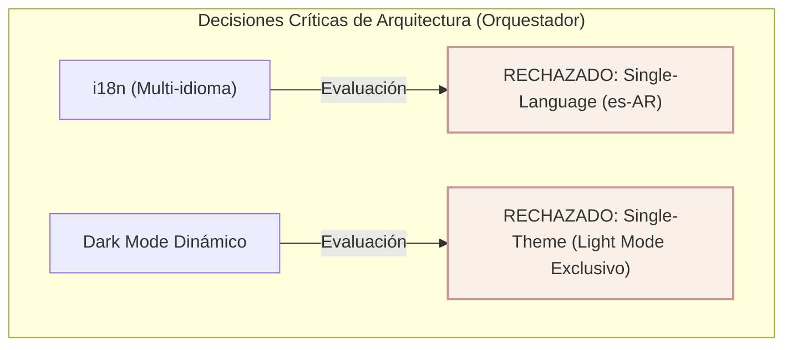
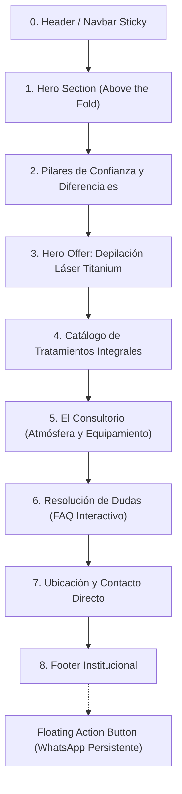

# Documento de Requerimientos de Producto (PRD)
## Proyecto: M&E Estética y Salud
**Agencia:** WAFLERS  
**Rol Activo:** Agente Orquestador (Lead Project Manager & UX/UI Architect)  
**Versión:** 1.0.0 (Fase Cero)  
**Fecha de Emisión:** 2026-10-07  
**Estado:** Aprobado para Ejecución de Especialistas  

---

## 1. Diagnóstico Estratégico y Resumen del Negocio

### 1.1 Ficha Técnica del Negocio
* **Razón Comercial:** M&E Estética y Salud.
* **Ubicación:** Av. San Martín 5355, Chacras de Coria, Luján de Cuyo, Mendoza, Argentina.
* **Modelo Operativo:** Consultorio privado de alta exclusividad. Atención 100% personalizada por su dueña, bajo esquema de turno previo programado. Sin sala de espera compartida, sin esperas y con garantía de privacidad absoluta (un solo paciente en cabina a la vez).
* **Canal Central de Adquisición / Conversión:** WhatsApp Business (`+54 9 261 681-7621`).
* **Presencia Digital:** Perfil activo en Instagram (`@mye_esteticasalud`); activación coordinada de perfil de Google Business post-lanzamiento.

### 1.2 Posicionamiento Estratégico
> *"Estética del Alma: Fusión integral entre el rigor técnico de la aparatología avanzada y la calidez holística de un espacio privado de relajación, atendido exclusivamente por su fundadora con 20 años de experiencia comprobada."*

### 1.3 Pilares de Autoridad y Ventajas Competitivas
1. **Aparatología Propia Permanente:** Equipamiento de última generación (Láser Titanium, Radiofrecuencia, Ultracavitación, Presoterapia) en consultorio fijo, sin depender de alquileres itinerantes ni fechas restringidas.
2. **Exclusividad y Privacidad Real:** Atención uno a uno a puertas cerradas. El paciente nunca se cruza con terceros.
3. **Aval de Laboratorio Oficial:** Distribuidora y representante oficial de activos dermocosméticos de **Laboratorio Laca**.
4. **Trayectoria y Calificación:** 20 años continuos de formación técnica en cosmetología y aparatología estética.
5. **Enfoque Unisex Real:** Servicios integrales y comunicación abierta sin sesgo de género.

---

## 2. Decisiones Críticas de Arquitectura



### 2.1 Decisión Crítica 1: Internacionalización (i18n)
* **Dictamen:** **NO APLICA. Se define arquitectura de idioma único (Español Argentina - `es-AR`).**
* **Fundamentación Técnica y de Negocio:**
  - El modelo de atención exige presencia física directa en el consultorio de Chacras de Coria, Mendoza.
  - El 100% del ciclo de captación, atención en cabina y soporte post-tratamiento es operado directamente por su dueña en español nativo.
  - La implementación de i18n añadiría overhead innecesario al bundle de JavaScript, complejidad en el enrutamiento y dispersión en la indexación de SEO Local sin representar retorno de inversión (ROI) para la conversión local.

### 2.2 Decisión Crítica 2: Dark Mode Dinámico
* **Dictamen:** **NO APLICA. Se define Single-Theme en Light Mode exclusivo ("Estética del Alma").**
* **Fundamentación Técnica y de Marca:**
  - La identidad de marca analizada en la planilla de onboarding exige transmitir pureza, luz, asepsia clínica, serenidad y bienestar holístico.
  - La directiva del cliente prohíbe explícitamente fondos negros pesados, contrastes oscuros agresivos y estéticas nocturnas.
  - La paleta se sustenta en blancos puros, grises neutros suaves, lilas y rosas pasteles botánicos. Un modo oscuro desvirtuaría la promesa de valor visual de higiene clínica y relajación de spa diurno.

---

## 3. Estrategia Global: CRO, SEO Local y Usabilidad

### 3.1 Estrategia de Conversión (CRO)
* **Arquitectura de Embudo:** Landing page One-Page con flujo vertical guiado de menor a mayor compromiso emocional/técnico.
* **Canalización Directa a WhatsApp:** El objetivo único de salida es la apertura de chat en WhatsApp con mensajes preformateados y contextualizados según la sección de origen:
  - Hero CTA: Consulta general / Agendamiento de valoración inicial.
  - Hero Offer CTA (Láser Titanium): Consulta de turnos y zonas para depilación definitiva.
  - Catálogo Facial / Corporal / Masajes: Consultas específicas por categoría.
* **Neutralización Preventiva de Fricciones (Filtro de Objeciones):**
  - *Objeción 1: ¿Atienden hombres?* $\rightarrow$ Integración explícita de mensaje Unisex transversal en toda la landing y en FAQ.
  - *Objeción 2: ¿El láser duele?* $\rightarrow$ Destacar el sistema de enfriamiento del Láser Titanium y protocolo indoloro.
  - *Objeción 3: ¿Cuándo hay turno?* $\rightarrow$ Resaltar que el equipo es propio, posibilitando turnos de lunes a sábado sin esperas mensuales.
  - *Objeción 4: Cuidados con el sol* $\rightarrow$ Especificación de protocolos seguros y asesoramiento previo para evitar manchas.
  - *Objeción 5: Formas de pago y turnos* $\rightarrow$ Transparencia sobre el proceso de reserva previa para preservar la exclusividad del consultorio.
* **Componentes Persistentes:** Botón Flotante de WhatsApp (FAB) con tooltip sutil para desktop y fixed bottom en viewport mobile.

### 3.2 Estrategia de SEO Local y Marcado Semántico
* **Keywords Principales (Target Geográfico Mendoza):**
  - Primarias: `depilacion definitiva chacras de coria`, `estetica chacras de coria`, `tratamientos faciales lujan de cuyo`.
  - Secundarias: `masajes descontracturantes chacras de coria`, `radiofrecuencia facial mendoza`, `presoterapia lujan de cuyo`, `productos laca chacras de coria`.
* **Jerarquía de Encabezados:**
  - `<h1>` único en el Hero, enfocado en el valor central y geolocalización.
  - `<h2>` semánticos en cada sección de servicio, diferenciales, testimonio/espacio, FAQ y contacto.
  - `<h3>` modulares para cada tratamiento individual y pregunta del acordeón.
* **Schema Markup Obligatorio:**
  - Inyección de JSON-LD estructurado tipo `HealthAndBeautyBusiness` / `DaySpa` en el `<head>`, conteniendo nombre, dirección física (`Av. San Martín 5355, Chacras de Coria`), coordenadas geográficas, número de teléfono, horarios y enlaces de redes.
* **Protocolo Open Graph (OG) y Twitter Cards:**
  - Metadatos esenciales (`og:title`, `og:description`, `og:image`, `og:url`, `og:type="website"`, `og:locale="es_AR"`) para renderizado de alta conversión al compartir el enlace en WhatsApp e Instagram.

### 3.3 Usabilidad (UX) y Accesibilidad (A11y)
* **Mobile-First Real:** Diseñado prioritariamente para pantallas táctiles de 360px a 430px (smartphone estándar del target local).
* **Dimensiones Táctiles:** Todos los botones, toggles de acordeón y enlaces deben contar con un área de contacto mínima de $48 \times 48\text{ px}$.
* **Performance Web (Core Web Vitals Target):**
  - Largest Contentful Paint (LCP) $\le 1.5\text{ s}$.
  - Cumulative Layout Shift (CLS) $\le 0.05$.
  - First Input Delay / INP $\le 100\text{ ms}$.
* **Accesibilidad Visual:** Contraste de texto y elementos interactivos regulado bajo estándar WCAG 2.1 AA (ratio mínimo 4.5:1 sobre fondo claro).

---

## 4. Mapa del Sitio y Wireframe Estructural

La landing se estructura como una experiencia One-Page fluida dividida en 9 secciones modulares:



### 4.1 Especificación Sección por Sección

#### Sección 0: Header / Navbar Sticky
* **ID / Ancla:** `#header`
* **Elementos Estructurales:**
  - Logotipo institucional M&E Estética y Salud con enlace al inicio (`#hero`).
  - Menú de navegación por anclas: `#diferenciales`, `#laser`, `#tratamientos`, `#consultorio`, `#faq`, `#contacto`.
  - Botón de Acción Rápida (CTA Header): Enlace directo a WhatsApp.
  - Indicador de estado en Mobile: Menú hamburguesa accesible con apertura sin layout shift.

#### Sección 1: Hero Section (Above the Fold)
* **ID / Ancla:** `#hero`
* **Propósito:** Captar la atención en menos de 5 segundos, comunicar la exclusividad y habilitar el primer punto de conversión.
* **Componentes:**
  - Badge de Confianza: Ubicación y modelo de atención (*"Chacras de Coria · Consultorio Privado Exclusivo"*).
  - Título Principal (`<h1>`): Propuesta de valor de alto impacto (estética integral + bienestar + rigor profesional).
  - Bajada descriptiva: Atención 100% personalizada por su dueña, equipamiento propio y turnos programados.
  - Grupo de CTAs:
    - CTA Primario: Botón destacado hacia WhatsApp (*"Agendar Valoración"*).
    - CTA Secundario: Botón fantasma hacia `#tratamientos` (*"Conocer Tratamientos"*).
  - Micro-Social Proof / Badges de Autoridad:
    - *20 años de experiencia*.
    - *Atención 1 a 1 sin esperas*.
    - *Aparatología propia permanente*.

#### Sección 2: Pilares de Confianza y Diferenciales ("La Experiencia M&E")
* **ID / Ancla:** `#diferenciales`
* **Propósito:** Justificar la elección del consultorio frente a centros masivos o franquicias.
* **Grid de 4 Tarjetas de Diferencial:**
  1. **Privacidad Absoluta:** Un paciente por turno; sin salas de espera compartidas ni interrupciones.
  2. **Equipamiento Propio:** Disponibilidad diaria real, sin alquileres de máquinas ni cancelaciones de fecha.
  3. **Trayectoria & Certificación:** 20 años de especialización técnica continua en cosmetología y aparatología.
  4. **Productos Oficiales Laca:** Tratamientos avalados con activos dermocosméticos originales de primer nivel.

#### Sección 3: Hero Offer — Depilación Definitiva Láser Titanium
* **ID / Ancla:** `#laser`
* **Propósito:** Explotar comercialmente el servicio estrella de mayor volumen, recurrencia y rentabilidad.
* **Componentes:**
  - Etiqueta de destaque: *"Servicio Estrella"*.
  - Título de Sección (`<h2>`): Tecnología Láser Titanium en Chacras de Coria.
  - Ficha de Ventajas Clave:
    - Cabezal con sistema de enfriamiento continuo (experiencia indolora y confortable).
    - Apto para todo tipo de piel durante todo el año.
    - Disponibilidad inmediata de turnos (equipo fijo en el gabinete).
    - Protocolo unisex estricto.
  - CTA Específico de Sección: Botón directo a WhatsApp con mensaje contextualizado para consultar zonas y disponibilidad de Láser Titanium.

#### Sección 4: Catálogo de Tratamientos Integrales
* **ID / Ancla:** `#tratamientos`
* **Propósito:** Desplegar la amplitud de servicios sin saturar visualmente al usuario.
* **Estructura en 3 Categorías (Grid o Pestañas Accesibles):**
  - **Bloque 4.1: Estética Facial:**
    - Limpieza profunda de cutis y peeling dermatológico.
    - Radiofrecuencia facial y espátula ultrasónica.
    - Tratamientos anti-age y nutrición con activos de Laboratorio Laca.
  - **Bloque 4.2: Estética Corporal:**
    - Reducción de adiposidad localizada, celulitis y flacidez (ultracavitación + radiofrecuencia).
    - Tonificación muscular con electroestimulación (electrodos).
    - Presoterapia secuencial y drenaje linfático integral (botas y abdomen).
  - **Bloque 4.3: Terapias de Bienestar y Descarga:**
    - Masajes descontracturantes, relajantes y sedativos.
    - Reflexología podal y sesiones de Reiki para equilibrio holístico.
* **Punto de Conversión:** Micro-CTA al pie de cada tarjeta o categoría para solicitar consulta personalizada en WhatsApp.

#### Sección 5: El Consultorio (Atmósfera y Equipamiento)
* **ID / Ancla:** `#consultorio`
* **Propósito:** Trasladar tranquilidad, pulcritud, estándares de higiene y calidez antes de la visita.
* **Componentes:**
  - Showcase visual del espacio real en Chacras de Coria (camilla, instrumental, orden, luz natural, gabinete privado).
  - Breve descripción del entorno: espacio íntimo diseñado para desconectar del ritmo diario.
  - *Slot Estructural de Reserva:* Contenedor semántico reservado y comentado para la fase posterior de "Casos de Éxito / Antes y Después" cuando el cliente complete el registro de testimonios fotográficos.

#### Sección 6: Preguntas Frecuentes (FAQ Interactivo)
* **ID / Ancla:** `#faq`
* **Propósito:** Derribar las últimas objeciones antes del contacto directo.
* **Componentes:**
  - Acordeón interactivo accesible con soporte nativo de `<details>`/`<summary>` o script accesible (ARIA expanded).
  - Preguntas obligatorias a cubrir:
    1. *¿Los tratamientos son para hombres y mujeres?*
    2. *¿El tratamiento de depilación láser Titanium genera dolor?*
    3. *¿Con qué frecuencia se coordinan los turnos de depilación?*
    4. *¿Qué cuidados con el sol debo tener antes y después de una sesión?*
    5. *¿Cómo se reservan los turnos y qué medios de pago se reciben?*

#### Sección 7: Ubicación y Contacto Directo
* **ID / Ancla:** `#contacto`
* **Propósito:** Brindar certezas geográficas y facilitar la llegada física del paciente.
* **Componentes:**
  - Dirección detallada: Av. San Martín 5355, Chacras de Coria, Luján de Cuyo, Mendoza.
  - Horarios y modalidad: Lunes a Sábados con turno previamente acordado.
  - Mapa de Google Maps interactivo o tarjeta con enlace directo a navegación por GPS.
  - Enlace directo a perfil de Instagram (`@mye_esteticasalud`).
  - Botón de llamada o mensaje directo a WhatsApp.

#### Sección 8: Footer Institucional
* **ID / Ancla:** `#footer`
* **Componentes:**
  - Logotipo institucional M&E.
  - Leyenda de propiedad intelectual y créditos de agencia WAFLERS.
  - Enlaces legales / disclaimer de responsabilidad médica y estética.
  - Enlace directo a WhatsApp e Instagram.

#### Componente Flotante: WhatsApp FAB
* **Posición:** Fijado en la esquina inferior derecha del viewport (`z-index` prioritario).
* **Comportamiento:** Icono oficial de WhatsApp con micro-animación de pulso discreto, no intrusivo, accesible vía teclado.

---

## 5. Árbol Definitivo de Directorios (`/assets/`)

El Programador y el Diseñador deberán utilizar con estricta rigurosidad la siguiente estructura de carpetas y nomenclatura de archivos:

```
mye-estetica/
└── assets/
    ├── brand/
    │   ├── logo.svg                    # Logotipo principal en formato vectorial SVG con fondo transparente
    │   ├── logo-compact.svg            # Isotipo reducido para favicon, navbar sticky y micro-elementos
    │   ├── favicon.ico                 # Favicon multi-resolución para navegadores
    │   └── og-image.jpg                # Imagen Open Graph 1200x630px para previsualización en WhatsApp y redes
    ├── hero/
    │   └── hero-wellness-bg.webp       # Imagen / textura de fondo optimizada en WebP para el Hero Section
    ├── clinic/
    │   └── gabinete-chacras.webp       # Fotografía optimizada en WebP del consultorio (procesada desde onboarding/gabinete.jpg)
    ├── services/
    │   ├── laser-titanium.webp         # Placeholder / asset fotográfico para Depilación Láser Titanium
    │   ├── facial-laca.webp            # Placeholder / asset para Tratamientos Faciales y Cosmética Laca
    │   ├── corporal-reductores.webp    # Placeholder / asset para Ultracavitación / Radiofrecuencia Corporal
    │   ├── presoterapia-drenaje.webp   # Placeholder / asset para Botas de Presoterapia y Drenaje Linfático
    │   └── masajes-reiki.webp          # Placeholder / asset para Masajes Descontracturantes y Terapias Holísticas
    └── icons/
        ├── check-shield.svg            # Ícono vectorial de seguridad, higiene y certificación
        ├── calendar-clock.svg          # Ícono vectorial de turno programado y puntualidad
        ├── spark.svg                   # Ícono vectorial de tecnología y aparatología de punta
        ├── lotus.svg                   # Ícono vectorial de bienestar, relajación y estética del alma
        ├── map-pin.svg                 # Ícono vectorial de ubicación en Chacras de Coria
        ├── phone.svg                   # Ícono vectorial de llamada directa
        ├── instagram.svg               # Ícono oficial de Instagram
        └── whatsapp.svg                # Ícono oficial de WhatsApp
```

### 5.1 Reglas Técnicas para el Procesamiento de Assets
1. **Logo (`logo.svg`):** El archivo crudo `onboarding/logo.jpg` contiene el isotipo botánico y la tipografía caligráfica. El Diseñador debe vectorizar o limpiar el fondo a transparencia pura antes de que el Programador lo incruste.
2. **Fotografía del Gabinete (`gabinete-chacras.webp`):** El archivo crudo `onboarding/gabinete.jpg` debe convertirse a formato moderno `.webp`, aplicando compresión visual sin pérdida perceptual, con un ancho máximo de $1440\text{ px}$ y peso inferior a $180\text{ KB}$.
3. **Imágenes de Servicios:** Deben estructurarse con relación de aspecto consistente ($4:3$ o $16:9$), cargarse con el atributo `loading="lazy"` y `decoding="async"`, excepto el Hero LCP que llevará `fetchpriority="high"`.

---

## 6. Matriz de Delegación (Formato Estructurado y Machine-Readable)

Esta matriz es el contrato operativo obligatorio para las siguientes fases del proyecto. Cada agente asume su rol leyendo sus inputs y produciendo sus entregables estipulados sin traspasar los límites asignados.

```yaml
delegation_matrix:
  project: "M&E Estética y Salud"
  orchestrator_version: "1.0.0"
  workflow_phase: "Fase Cero Concluida -> Handover a Especialistas"
  
  roles:
    copywriter:
      role_title: "Lead Copywriter & Local SEO Strategist"
      directive_file: "../.waflers/copywriter.md"
      inputs:
        - "PRD.md"
        - "onboarding/onboarding-mye.md"
      outputs:
        primary: "dev-brief.md"
        post_launch: "google-business.md"
      responsibilities:
        - "Redactar el copy persuasivo final sección por sección según el mapa del sitio del PRD."
        - "Desarrollar los textos exactos para H1, H2, bajadas descriptivas y microcopy de objeciones."
        - "Definir los mensajes de texto predeterminados codificados para cada botón de WhatsApp según servicio."
        - "Integrar palabras clave de SEO Local (Chacras de Coria, Luján de Cuyo, Mendoza) sin keyword stuffing."
        - "Redactar los metadatos Open Graph obligatorios: og:title y og:description."
      strict_prohibitions:
        - "PROHIBIDO inventar servicios no validados en el PRD ni alterar el mapa del sitio."
        - "PROHIBIDO escribir código HTML, CSS o JavaScript."
        - "PROHIBIDO utilizar Spanglish o frases genéricas desalineadas del tono 'Estética del Alma'."

    disenador:
      role_title: "Lead UI Designer, Interaction & Design System Architect"
      directive_file: "../.waflers/disenador.md"
      inputs:
        - "PRD.md"
        - "onboarding/onboarding-mye.md"
        - "onboarding/logo.jpg"
      outputs:
        primary: "design-system.md"
      responsibilities:
        - "Auditar la paleta de marca requerida (blanco puro, gris neutro suave, rosa pastel/floral, lila suave, tonos acuarela botánicos y nude) garantizando ratio WCAG 2.1 AA (mínimo 4.5:1)."
        - "Definir la escala tipográfica armónica, tokens de color en formato HEX y variables CSS."
        - "Establecer la grilla basada en módulos de 8px y reglas de espaciado."
        - "Definir estados interactivos (hover, active, focus-visible) y feedback de botones."
        - "Proveer pautas para la vectorización de logo.jpg a logo.svg y logo-compact.svg."
      strict_prohibitions:
        - "PROHIBIDO escribir copy persuasivo definitivo."
        - "PROHIBIDO maquetar código HTML o JS."
        - "PROHIBIDO incorporar modo oscuro (Dark Mode prohibido por decisión crítica del Orquestador)."

    programador:
      role_title: "Lead Frontend Developer & Performance Engineer"
      directive_file: "../.waflers/programador.md"
      inputs:
        - "PRD.md"
        - "design-system.md"
        - "dev-brief.md"
        - "assets/"
      outputs:
        primary: "index.html"
        secondary: "styles.css / main.js (o estructura de componentes)"
      responsibilities:
        - "Maquetar la landing page respetando estrictamente el mapa del sitio del PRD y los tokens de design-system.md."
        - "Ensamblar el código Mobile-First, garantizando 60fps y semántica HTML5 pura."
        - "Conectar rigurosamente los recursos siguiendo la estructura de /assets/."
        - "Inyectar metadatos en el head: Open Graph (og:title, og:description, og:image) y Schema.org JSON-LD de LocalBusiness."
        - "Implementar el acordeón de FAQ accesible y los enlaces a WhatsApp con los parámetros URL exactos."
      strict_prohibitions:
        - "PROHIBIDO hardcodear colores, tipografías, o espaciados que no provengan de variables CSS del design-system.md."
        - "PROHIBIDO alterar el copy redactado en el dev-brief.md o cambiar el orden de las secciones del PRD."

    qa:
      role_title: "Lead QA Auditor & Quality Control"
      directive_file: "../.waflers/qa.md"
      inputs:
        - "PRD.md"
        - "design-system.md"
        - "dev-brief.md"
        - "Código fuente generado"
      outputs:
        primary: "qa-report.md"
      responsibilities:
        - "Auditar la fidelidad visual contra design-system.md y detectar cualquier atributo hardcodeado."
        - "Verificar la ausencia total de desborde horizontal (overflow-x) en resoluciones mobile (360px a 430px)."
        - "Validar que los botones e interactivos cumplan el target táctil mínimo de 48x48px."
        - "Comprobar contraste WCAG 2.1 AA (4.5:1), atributos alt descriptivos y loading='lazy' en imágenes secundarias."
        - "Validar funcionamiento sintáctico y de enlaces (número WhatsApp internacional +5492616817621 y mensajes predeterminados)."
        - "Emitir veredicto definitivo (Aprobado o Correcciones Requeridas)."
      strict_prohibitions:
        - "PROHIBIDO emitir alertas genéricas de consola irrelevantes para la conversión o el PRD."
```

---

## 7. Próximos Pasos del Flujo de Trabajo (Pipeline WAFLERS)

1. **Paso 1:** El **Copywriter** toma el `PRD.md` y produce `dev-brief.md`.
2. **Paso 2:** El **Diseñador** toma el `PRD.md` y produce `design-system.md`.
3. **Paso 3:** El **Programador** toma `PRD.md`, `dev-brief.md` y `design-system.md` para ensamblar la web.
4. **Paso 4:** El **QA** ejecuta la auditoría completa y emite el dictamen final.
