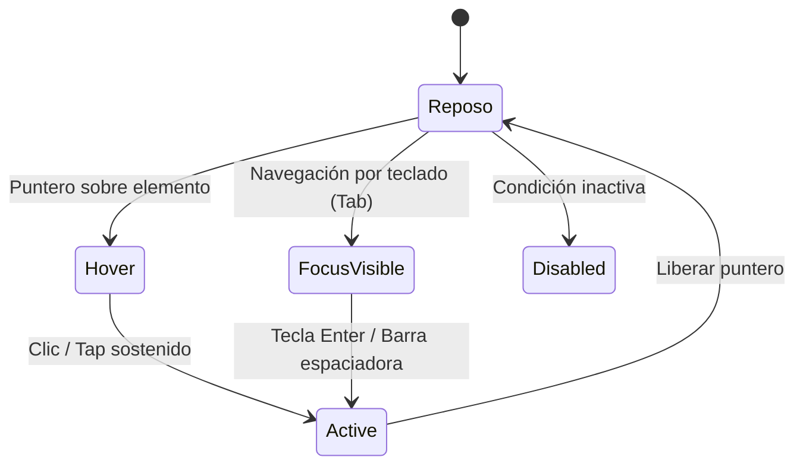

# Sistema de Diseño UI/UX & Tokens de Identidad: M&E Estética y Salud
**Agencia:** WAFLERS  
**Rol:** Lead UI Designer, Interaction & Design System Architect  
**Versión:** 1.0.0 (Fase de Diseño & Tokens de Producción)  
**Fecha:** 2026-10-07  
**Concepto Rector:** *Estética del Alma* (Armonía Holística + Rigor Técnico Clínico + Serenidad Botánica).  
**Fuente de Verdad Técnica:** Obligatoria para maquetación en Frontend (`globals.css` / variables CSS).  

---

## 1. Fundamentos & Manifiesto Visual

El sistema visual de **M&E Estética y Salud** traduce la identidad de consultorio privado de alta exclusividad en una experiencia digital luminosa, serena y clínicamente pulcra. Se fundamenta en el equilibrio entre dos mundos complementarios:
1. **La Calidez y Relajación del Spa Holístico:** Fondos etéreos, blancos puros, sutiles tintes lavanda y rosa floral que transmiten confort, privacidad y desconexión.
2. **El Rigor y la Asepsia de la Tecnología Médica:** Tipografía con espaciado matemático, contrastes calibrados bajo normativa estricta, estructura geométrica limpia y ausencia absoluta de artificios estridentes.

### Principios Rectores de Interfaz:
* **Luz y Pureza (Single-Theme Light Mode):** Se prohíbe el modo oscuro y fondos negros pesados en conformidad con la Decisión Crítica del PRD. El lienzo emula la pulcritud de las sábanas de lino blanco, la luz natural del consultorio en Chacras de Coria y la tranquilidad de cabina privada.
* **Cromaticidad Botánica de Acento:** Los pasteles solicitados por el cliente (rosas, lilas, nude) se estructuran como superficies de apoyo, contenedores y micro-detalles. Para textos e interactivos, se introducen sus versiones cromáticas profundas para garantizar legibilidad matemática absoluta.
* **Feedback Visual Consciente (Micro-UX):** Cada punto de contacto táctil responde con suavidad, evitando transiciones bruscas o animaciones que rompan la atmósfera de serenidad.

---

## 2. Auditoría Cromática & Regla de Autoridad (WCAG 2.1 AA)

### 2.1 Diagnóstico Técnico de la Solicitud del Cliente
En la planilla de onboarding, el cliente solicita una paleta compuesta por:
> *"Blanco puro, gris neutro suave, rosa pastel/floral, lila suave, tonos acuarela botánicos y nude. Evitar tonos estridentes o fondos negros."*

**Veredicto de Auditoría UI/UX:**
Los tonos pasteles puros (ej. rosa `#F9CCD6` o lila `#DECFF0`) poseen una luminancia relativa excesivamente alta ($L \approx 0.70 - 0.85$). Si un desarrollador intentara utilizar texto pastel sobre fondo blanco (`#FFFFFF`), el ratio de contraste resultante sería de apenas **$1.3:1$ a $1.8:1$**, violando de forma crítica la pauta WCAG 2.1 AA (mínimo de $4.5:1$ para texto regular). Esto generaría inaccesibilidad total y pérdida masiva de conversión.

### 2.2 Solución por Regla de Autoridad: Sistema de Color Dual
Para honrar la esencia de la marca sin sacrificar la conversión ni la accesibilidad, se establece un **sistema cromático dual**:
1. **Gama Soft (Superficies & Atmósfera):** Utiliza los pasteles solicitados (rosa acuarela, lavanda suave, alabastro cálido) exclusivamente en fondos de tarjetas, badges, bordes sutiles y áreas no textuales.
2. **Gama Deep (Tipografía & Acentos Activos):** Introduce variantes cromáticas profundas en base ciruela, pizarra cálida y malva botánico, formuladas para superar con holgura los ratios WCAG AA ($4.5:1$) y AAA ($7:1$).

### 2.3 Demostración Matemática de Contraste WCAG
La luminancia relativa ($L$) se calcula formalmente bajo la fórmula CIE:
$$L = 0.2126 \cdot f(R) + 0.7152 \cdot f(G) + 0.0722 \cdot f(B)$$
Donde $f(C) = (C/255 \le 0.04045) \; ? \; \frac{C/255}{12.92} : \left(\frac{C/255 + 0.055}{1.055}\right)^{2.4}$  
El ratio de contraste ($CR$) entre dos luminancias es:
$$CR = \frac{L_1 + 0.05}{L_2 + 0.05} \quad (L_1 \ge L_2)$$

#### Tabla de Verificación Matemática de Contraste:

| Elemento / Rol | Código HEX | Luminancia ($L$) | Fondo Comparado | Ratio ($CR$) | Estado WCAG 2.1 |
| :--- | :--- | :--- | :--- | :--- | :--- |
| **Texto Titulares (`h1-h4`)** | `#26212B` *(Deep Plum Charcoal)* | $0.0167$ | `#FFFFFF` ($L=1.0$) | **$15.74:1$** | **PASA (Excede AAA)** |
| **Texto Base / Párrafos** | `#463F4D` *(Warm Slate)* | $0.0529$ | `#FFFFFF` ($L=1.0$) | **$10.20:1$** | **PASA (Excede AAA)** |
| **Texto Base sobre Card Suave** | `#463F4D` *(Warm Slate)* | $0.0529$ | `#FAF8F5` ($L=0.9389$) | **$9.61:1$** | **PASA (Excede AAA)** |
| **Texto Secundario / Metadatos** | `#696070` *(Botanical Slate Muted)* | $0.1219$ | `#FFFFFF` ($L=1.0$) | **$6.11:1$** | **PASA (Excede AA $4.5:1$)** |
| **Texto Secundario sobre Card** | `#696070` *(Botanical Slate Muted)* | $0.1219$ | `#FAF8F5` ($L=0.9389$) | **$5.75:1$** | **PASA (Excede AA $4.5:1$)** |
| **Acento Botánico Primario** | `#8A3358` *(Peony Deep)* | $0.0828$ | `#FFFFFF` ($L=1.0$) | **$7.91:1$** | **PASA (Excede AAA)** |
| **Texto Blanco en Botón Acento** | `#FFFFFF` ($L=1.0$) | $1.0000$ | `#8A3358` ($L=0.0828$) | **$7.91:1$** | **PASA (Excede AAA)** |
| **Acento Ciruela / Lavanda Deep** | `#5E3A74` *(Plum Deep)* | $0.0655$ | `#FFFFFF` ($L=1.0$) | **$9.09:1$** | **PASA (Excede AAA)** |
| **Fondo WhatsApp Primario (FAB)** | `#25D366` *(WA Green)* | $0.4810$ | `#0B2818` *(Texto/Ícono)* | **$8.05:1$** | **PASA (Excede AAA)** |
| **Botón Sólido de Conversión WA** | `#0D5C3A` *(WA Forest)* | $0.0740$ | `#FFFFFF` *(Texto Blanco)* | **$8.47:1$** | **PASA (Excede AAA)** |

> [!IMPORTANT]
> **Regla de Conversión WhatsApp:** Queda terminantemente prohibido colocar texto blanco (`#FFFFFF`) directamente sobre el verde neón `#25D366`, ya que genera un ratio deficiente de $1.97:1$. Cuando se use el fondo oficial `#25D366` en el FAB flotante, el ícono/tipografía será verde bosque profundo (`#0B2818`). En botones sólidos de llamada a la acción dentro del flujo de la landing, se utilizará `#0D5C3A` con texto blanco puro (`#FFFFFF`).

---

## 3. Tokens Cromáticos Semánticos

```
┌────────────────────────────────────────────────────────────────────────┐
│ SURFACE CANVAS (#FFFFFF)          ──> Lienzo base absoluto             │
│ SURFACE CARD WARM (#FAF8F5)       ──> Contenedor secundario cálido     │
│ SURFACE LILAC SOFT (#F5F2F7)      ──> Fondo de categorías y badges     │
│ SURFACE ROSE SOFT (#FAF0F3)       ──> Fondo Hero Offer Láser Titanium  │
│                                                                        │
│ TEXT PRIMARY (#26212B) [15.7:1]   ──> H1, H2, precios y cifras clave   │
│ TEXT BODY (#463F4D)    [10.2:1]   ──> Párrafos y descripciones clínicas│
│ TEXT MUTED (#696070)   [6.1:1]    ──> Microcopy, labels y subtítulos   │
│                                                                        │
│ ACCENT PEONY DEEP (#8A3358)       ──> Enlaces activos, botones de marca│
│ ACCENT PLUM DEEP (#5E3A74)        ──> Badges de especialidad y tags    │
│ CONVERSION WA (#25D366 / #0D5C3A) ──> Call to Action de turnos         │
└────────────────────────────────────────────────────────────────────────┘
```

### Tabla Exhaustiva de Tokens de Color:

| Token Semántico | Valor HEX | Valor RGB / RGBA | Aplicación en Maquetación |
| :--- | :--- | :--- | :--- |
| `--color-canvas` | `#FFFFFF` | `rgb(255, 255, 255)` | Fondo general del body y áreas despejadas. |
| `--color-surface-card` | `#FAF8F5` | `rgb(250, 248, 245)` | Tarjetas de diferenciales y bloques de consultorio. |
| `--color-surface-rose` | `#FAF0F3` | `rgb(250, 240, 243)` | Fondo contenedor del bloque Hero Offer (Láser). |
| `--color-surface-lilac` | `#F5F2F7` | `rgb(245, 242, 247)` | Fondo de tarjetas de faciales y masajes holísticos. |
| `--color-border-subtle` | `#EDE7E3` | `rgb(237, 231, 227)` | Bordes perimetrales de tarjetas y divisores sutiles. |
| `--color-border-accent` | `#E3D5DC` | `rgb(227, 213, 220)` | Borde de tarjetas destacadas y campos interactivos. |
| `--color-text-primary` | `#26212B` | `rgb(38, 33, 43)` | Encabezados principales (`h1`, `h2`, `h3`), valoraciones. |
| `--color-text-body` | `#463F4D` | `rgb(70, 63, 77)` | Cuerpo de texto, preguntas frecuentes y lectura base. |
| `--color-text-muted` | `#696070` | `rgb(105, 96, 112)` | Fechas, microcopy, notas al pie y metadatos. |
| `--color-accent-rose` | `#8A3358` | `rgb(138, 51, 88)` | Botones de marca secundarios, texto de enlace y badges. |
| `--color-accent-rose-hover`| `#712746` | `rgb(113, 39, 70)` | Estado hover de botones en color rosa profundo. |
| `--color-accent-plum` | `#5E3A74` | `rgb(94, 58, 116)` | Íconos de servicios, viñetas de lista y acentos visuales. |
| `--color-wa-btn` | `#0D5C3A` | `rgb(13, 92, 58)` | Fondo de botones primarios de reserva a WhatsApp. |
| `--color-wa-btn-hover` | `#083F27` | `rgb(8, 63, 39)` | Estado hover de botones primarios a WhatsApp. |
| `--color-wa-fab` | `#25D366` | `rgb(37, 211, 102)` | Fondo del botón flotante permanente (FAB). |
| `--color-wa-fab-text` | `#0B2818` | `rgb(11, 40, 24)` | Color de ícono SVG en el botón flotante (FAB). |
| `--color-focus-ring` | `#8A3358` | `rgba(138, 51, 88, 0.45)`| Anillo de accesibilidad para teclado (`:focus-visible`). |

---

## 4. Escala Tipográfica & Jerarquía Editorial

### 4.1 Selección Tipográfica de Marca
Para balancear la exclusividad estética y la máxima velocidad de lectura en dispositivos móviles, se define una pareja tipográfica optimizada:
1. **Tipografía Display & Títulos (`--font-display`):**  
   **`Cormorant Garamond`** (alternativa / fallback: `Playfair Display`, `ui-serif, Georgia, serif`).  
   *Carácter:* Clásica, elegante, botánica y refinada. Aporta la personalidad de "Estética del Alma".
2. **Tipografía de Interfaz & Lectura (`--font-sans`):**  
   **`Plus Jakarta Sans`** (alternativa / fallback: `Inter`, `ui-sans-serif, system-ui, sans-serif`).  
   *Carácter:* Geométrica, moderna, neutra, con aperturas amplias para legibilidad impecable en pantallas mobile pequeñas (360px - 430px).

### 4.2 Escala Modular (Ratio 1.25 - Major Third)

| Nivel Semántico | Token CSS | Tamaño Móvil | Tamaño Desktop | Line Height | Peso | Tracking |
| :--- | :--- | :--- | :--- | :--- | :--- | :--- |
| **Display / Hero H1** | `--text-display` | `32px (2.00rem)` | `48px (3.00rem)` | `1.15` | `600 (SemiBold)` | `-0.02em` |
| **Sección H2** | `--text-h2` | `26px (1.625rem)`| `36px (2.25rem)` | `1.22` | `600 (SemiBold)` | `-0.015em` |
| **Subsección H3** | `--text-h3` | `20px (1.25rem)` | `24px (1.50rem)` | `1.30` | `600 (SemiBold)` | `-0.01em` |
| **Tarjeta H4** | `--text-h4` | `18px (1.125rem)`| `20px (1.25rem)` | `1.35` | `600 (SemiBold)` | `0.00em` |
| **Lead / Bajada** | `--text-lead` | `17px (1.0625rem)`| `18px (1.125rem)`| `1.50` | `400 (Regular)` | `0.00em` |
| **Body / Párrafo** | `--text-body` | `15px (0.9375rem)`| `16px (1.00rem)` | `1.60` | `400 (Regular)` | `0.00em` |
| **Microcopy / FAQ** | `--text-sm` | `13px (0.8125rem)`| `14px (0.875rem)` | `1.50` | `400 / 500` | `+0.01em` |
| **Badges / Labels** | `--text-xs` | `11px (0.6875rem)`| `12px (0.75rem)`  | `1.40` | `600 (SemiBold)` | `+0.04em (Uppercase)` |

---

## 5. Grilla Espacial de 8px & Layout

Todo padding, margen, gap y altura se construye estrictamente sobre múltiplos de $8\text{px}$ (o submúltiplo exacto de $4\text{px}$ para micro-espaciados).

### 5.1 Tokens de Espaciado:

```
┌────────────────────────────────────────────────────────┐
│ space-1  : 4px   ──> Micro-gaps entre icono y label    │
│ space-2  : 8px   ──> Base del sistema / Padding chips  │
│ space-3  : 12px  ──> Padding interno botones compactos │
│ space-4  : 16px  ──> Padding estándar cards mobile     │
│ space-6  : 24px  ──> Padding de tarjetas desktop / Gap │
│ space-8  : 32px  ──> Separación de bloques internos    │
│ space-12 : 48px  ──> Altura mínima de contacto táctil   │
│ space-16 : 64px  ──> Padding vertical secciones mobile │
│ space-20 : 80px  ──> Separador de secciones desktop    │
│ space-24 : 96px  ──> Padding vertical Hero Section     │
└────────────────────────────────────────────────────────┘
```

| Token CSS | Valor en Píxeles | Valor Relativo | Caso de Uso |
| :--- | :--- | :--- | :--- |
| `--space-1` | `4px` | `0.25rem` | Separación horizontal entre ícono y texto en botones. |
| `--space-2` | `8px` | `0.50rem` | Padding vertical de badges y chips informativos. |
| `--space-3` | `12px` | `0.75rem` | Espaciado entre items de listas compactas. |
| `--space-4` | `16px` | `1.00rem` | Padding lateral de contenedores en mobile; gap de grids. |
| `--space-5` | `20px` | `1.25rem` | Margen inferior de párrafos y títulos secundarios. |
| `--space-6` | `24px` | `1.50rem` | Padding interno de tarjetas de catálogo y testimonios. |
| `--space-8` | `32px` | `2.00rem` | Margen inferior entre grupos temáticos. |
| `--space-10` | `40px` | `2.50rem` | Espacio perimetral de cabeceras de sección. |
| `--space-12` | `48px` | `3.00rem` | **Touch target mínimo reglamentario para botones.** |
| `--space-16` | `64px` | `4.00rem` | Separación vertical estándar entre secciones en mobile. |
| `--space-20` | `80px` | `5.00rem` | Separación vertical estándar entre secciones en desktop. |
| `--space-24` | `96px` | `6.00rem` | Padding superior de la Hero Section bajo navbar sticky. |

### 5.2 Arquitectura de Grilla y Contenedores:
* **Max-width del Contenedor Principal:** `1160px` (`--container-max`).
* **Padding Lateral Seguro (Viewport Gutter):**
  - Mobile ($< 640\text{px}$): `16px` (`--space-4`).
  - Tablet ($640\text{px} - 1024\text{px}$): `24px` (`--space-6`).
  - Desktop ($> 1024\text{px}$): `32px` (`--space-8`).
* **Grilla Responsiva:**
  - Mobile: 1 columna con gap de `16px`.
  - Tablet: 2 columnas con gap de `24px`.
  - Desktop: 3 columnas para servicios / 4 columnas para diferenciales con gap de `24px`.

---

## 6. Micro-UX, Elevación y Comportamiento Interactivo

### 6.1 Radios de Borde (Border Radius):
* `--radius-sm` (`6px`): Badges pequeños, inputs de formulario.
* `--radius-md` (`12px`): Tarjetas de catálogo secundarias, acordeón de FAQ.
* `--radius-lg` (`20px`): Tarjetas contenedoras principales, bloque destacado de Láser Titanium.
* `--radius-full` (`9999px`): Botones de acción (Pills), selector de tags, Floating Action Button (FAB).

### 6.2 Sistema de Elevación (Sombras Botánicas Suaves):
Para preservar la luz natural sin recurrir a sombras oscuras artificiales, las sombras se tiñen suavemente con la base ciruela cálida (`rgba(38, 33, 43, ...)`):
* `--shadow-sm`: `0 2px 8px rgba(38, 33, 43, 0.04)` $\rightarrow$ Tarjetas en reposo.
* `--shadow-md`: `0 8px 24px rgba(38, 33, 43, 0.08)` $\rightarrow$ Tarjetas en hover, navbar sticky.
* `--shadow-lg`: `0 16px 36px rgba(38, 33, 43, 0.12)` $\rightarrow$ Modales, FAB flotante de WhatsApp.
* `--shadow-glow-wa`: `0 6px 20px rgba(37, 211, 102, 0.35)` $\rightarrow$ Resplandor sutil del botón flotante.

### 6.3 Tokens de Transición:
* `--ease-spring`: `cubic-bezier(0.16, 1, 0.3, 1)` $\rightarrow$ Efecto de desaceleración suave y orgánico.
* `--duration-fast`: `150ms` $\rightarrow$ Toggles, feedback activo de clic.
* `--duration-normal`: `250ms` $\rightarrow$ Hover de tarjetas, desplazamiento de sombras y elevación.
* `--duration-slow`: `400ms` $\rightarrow$ Despliegue de acordeón FAQ y apertura de menú mobile.

### 6.4 Matriz de Estados Interactivos:



1. **Estado Reposo (Default):**
   - Elevación base (`--shadow-sm` o plana).
   - Borde sutil definido (`--color-border-subtle`).
2. **Estado Hover (Puntero activo):**
   - Elevación visual suave: `transform: translateY(-2px); box-shadow: var(--shadow-md);`.
   - Transición: `transition: transform var(--duration-normal) var(--ease-spring), box-shadow var(--duration-normal) var(--ease-spring);`.
   - Botón Primario WhatsApp: Fondo cambia a `--color-wa-btn-hover`.
   - Botón Secundario Rosa: Fondo cambia a `--color-accent-rose-hover`.
3. **Estado Active (Tap / Clic presionado):**
   - Retroceso táctil: `transform: translateY(0) scale(0.98);`.
4. **Estado Focus-Visible (Navegación por teclado / A11y):**
   - Contorno mandatorio accesible: `outline: 2px solid var(--color-accent-rose); outline-offset: 3px;`.
   - Prohibido suprimir el contorno con `outline: none` sin proveer anillo alternativo visible.
5. **Estado Disabled (Deshabilitado):**
   - Opacidad al `50%` (`opacity: 0.5`).
   - Cursor: `cursor: not-allowed; pointer-events: none;`.

### 6.5 Ergonomía Táctil en Mobile:
* Todos los botones, toggles de acordeón de FAQ y enlaces principales tienen una altura mínima garantizada de **$48\text{px}$** (`--space-12`), cumpliendo las directrices de Apple Human Interface Guidelines y Google Material Touch Target.

---

## 7. Hoja Maestra de Variables CSS (`globals.css`)

El Programador debe copiar e inyectar íntegramente este bloque en la raíz de los estilos del proyecto (`styles.css` o `globals.css`):

```css
/* ==========================================================================
   M&E ESTÉTICA Y SALUD - DESIGN SYSTEM TOKENS v1.0.0
   Generado por: Agente Diseñador (WAFLERS)
   Normativa: WCAG 2.1 AA | Grid: 8px | Tema: Light Mode Exclusivo
   ========================================================================== */

:root {
  /* ------------------------------------------------------------------------
     1. COLOR SYSTEM (Superficies & Lienzos)
     ------------------------------------------------------------------------ */
  --color-canvas: #FFFFFF;
  --color-surface-card: #FAF8F5;
  --color-surface-rose: #FAF0F3;
  --color-surface-lilac: #F5F2F7;
  
  /* ------------------------------------------------------------------------
     2. COLOR SYSTEM (Bordes & Divisores)
     ------------------------------------------------------------------------ */
  --color-border-subtle: #EDE7E3;
  --color-border-accent: #E3D5DC;

  /* ------------------------------------------------------------------------
     3. COLOR SYSTEM (Tipografía con Contraste Garantizado)
     ------------------------------------------------------------------------ */
  --color-text-primary: #26212B; /* Ratio 15.7:1 sobre blanco (AAA) */
  --color-text-body: #463F4D;    /* Ratio 10.2:1 sobre blanco (AAA) */
  --color-text-muted: #696070;   /* Ratio 6.1:1 sobre blanco (AA) */
  --color-text-inverse: #FFFFFF; /* Para botones oscuros y badges */

  /* ------------------------------------------------------------------------
     4. COLOR SYSTEM (Acentos de Marca & CRO)
     ------------------------------------------------------------------------ */
  --color-accent-rose: #8A3358;       /* Ratio 7.9:1 sobre blanco (AAA) */
  --color-accent-rose-hover: #712746;
  --color-accent-plum: #5E3A74;       /* Ratio 9.1:1 sobre blanco (AAA) */
  --color-focus-ring: rgba(138, 51, 88, 0.45);

  /* ------------------------------------------------------------------------
     5. COLOR SYSTEM (Conversión WhatsApp Oficial)
     ------------------------------------------------------------------------ */
  --color-wa-btn: #0D5C3A;            /* Ratio 8.5:1 con texto blanco */
  --color-wa-btn-hover: #083F27;
  --color-wa-fab: #25D366;            /* Verde WhatsApp para FAB */
  --color-wa-fab-text: #0B2818;       /* Ratio 8.1:1 sobre #25D366 */

  /* ------------------------------------------------------------------------
     6. TIPOGRAFÍA (Familias)
     ------------------------------------------------------------------------ */
  --font-display: 'Cormorant Garamond', ui-serif, Georgia, serif;
  --font-sans: 'Plus Jakarta Sans', ui-sans-serif, system-ui, -apple-system, BlinkMacSystemFont, 'Segoe UI', Roboto, sans-serif;

  /* ------------------------------------------------------------------------
     7. TIPOGRAFÍA (Escala de Tamaños Fluidos)
     ------------------------------------------------------------------------ */
  --text-display: clamp(2.00rem, 4vw + 1rem, 3.00rem);   /* 32px a 48px */
  --text-h2: clamp(1.625rem, 2.5vw + 1rem, 2.25rem);      /* 26px a 36px */
  --text-h3: clamp(1.25rem, 1.5vw + 1rem, 1.50rem);        /* 20px a 24px */
  --text-h4: clamp(1.125rem, 1vw + 1rem, 1.25rem);         /* 18px a 20px */
  --text-lead: clamp(1.0625rem, 0.5vw + 1rem, 1.125rem);   /* 17px a 18px */
  --text-body: 1rem;                                       /* 16px base */
  --text-sm: 0.875rem;                                     /* 14px */
  --text-xs: 0.75rem;                                      /* 12px */

  /* ------------------------------------------------------------------------
     8. TIPOGRAFÍA (Line Heights)
     ------------------------------------------------------------------------ */
  --leading-tight: 1.15;
  --leading-snug: 1.25;
  --leading-normal: 1.40;
  --leading-relaxed: 1.60;

  /* ------------------------------------------------------------------------
     9. ESPACIADO (Grid de 8px)
     ------------------------------------------------------------------------ */
  --space-1: 0.25rem;   /* 4px */
  --space-2: 0.50rem;   /* 8px */
  --space-3: 0.75rem;   /* 12px */
  --space-4: 1.00rem;   /* 16px */
  --space-5: 1.25rem;   /* 20px */
  --space-6: 1.50rem;   /* 24px */
  --space-8: 2.00rem;   /* 32px */
  --space-10: 2.50rem;  /* 40px */
  --space-12: 3.00rem;  /* 48px - Target Táctil Mínimo */
  --space-16: 4.00rem;  /* 64px */
  --space-20: 5.00rem;  /* 80px */
  --space-24: 6.00rem;  /* 96px */

  /* ------------------------------------------------------------------------
     10. RADIOS DE BORDE (Border Radius)
     ------------------------------------------------------------------------ */
  --radius-sm: 6px;
  --radius-md: 12px;
  --radius-lg: 20px;
  --radius-full: 9999px;

  /* ------------------------------------------------------------------------
     11. SOMBRAS BOTÁNICAS & ELEVACIÓN
     ------------------------------------------------------------------------ */
  --shadow-sm: 0 2px 8px rgba(38, 33, 43, 0.04);
  --shadow-md: 0 8px 24px rgba(38, 33, 43, 0.08);
  --shadow-lg: 0 16px 36px rgba(38, 33, 43, 0.12);
  --shadow-glow-wa: 0 6px 20px rgba(37, 211, 102, 0.35);

  /* ------------------------------------------------------------------------
     12. TRANSICIONES & TIMING
     ------------------------------------------------------------------------ */
  --ease-spring: cubic-bezier(0.16, 1, 0.3, 1);
  --duration-fast: 150ms;
  --duration-normal: 250ms;
  --duration-slow: 400ms;

  /* ------------------------------------------------------------------------
     13. LAYOUT
     ------------------------------------------------------------------------ */
  --container-max: 1160px;
}
```

---

## 8. Directivas de Vectorización y Tratamiento de Assets

El Programador y el equipo técnico deben seguir estas directrices al manipular los recursos de `/assets/`:

1. **Vectorización del Logotipo (`logo.svg` y `logo-compact.svg`):**
   * El archivo crudo `onboarding/logo.jpg` debe ser limpiado removiendo el fondo rasterizado opaco para obtener transparencia pura.
   * La flor botánica y la tipografía "M&E" deben representarse como vectores SVG limpios con atributos `viewBox` para escalar con nitidez desde $28\text{px}$ (mobile header) hasta $160\text{px}$ (footer).
   * El color primario del SVG debe utilizar `currentColor` o mapear a `--color-text-primary` y `--color-accent-rose`.
2. **Fotografía del Espacio (`gabinete-chacras.webp`):**
   * El archivo `onboarding/gabinete.jpg` debe procesarse con una curva de brillo y balance de blancos sutilmente cálida, asegurando que los blancos de la camilla luzcan puros y clínicos sin quemar las altas luces.
   * Compresión en formato `.webp` con calidad 82%, preservando la nitidez de la torre de aparatología y la lupa de trabajo.
3. **Íconos del Sistema (`/assets/icons/*.svg`):**
   * Todos los íconos deben utilizar un trazo uniforme de $1.5\text{px}$ a $2\text{px}$ de grosor (`stroke-width: 1.75`), terminales redondeadas (`stroke-linecap: round; stroke-linejoin: round;`) y viewBox cuadrado de $24 \times 24\text{ px}$.
   * Deben heredar color mediante `stroke="currentColor"`.

---

## 9. Criterios de Aceptación para QA Visual

El Agente QA evaluará la implementación visual con base en los siguientes criterios intransigibles:
1. **Cero Atributos Hardcodeados:** Ninguna regla CSS debe declarar colores HEX o fuentes directamente si existe un token en `:root`.
2. **Contraste Mínimo WCAG 2.1 AA:** Todo texto visible contra su fondo inmediato debe certificar un ratio $\ge 4.5:1$ con herramienta de contraste automatizada.
3. **Target Táctil Mobile:** Ningún botón o interactivo en resolución mobile ($< 640\text{px}$) puede medir menos de $48\text{px}$ de altura útil.
4. **Anillo Focus Accesible:** La navegación vía tecla `Tab` debe mostrar el anillo de foco `--color-focus-ring` sin clipping de contenedor.
5. **Estabilidad de Layout (CLS = 0):** Los elementos en hover solo alteran propiedades transformables por hardware (`transform`, `opacity`, `box-shadow`), evitando alterar `margin`, `padding` o `width`.
